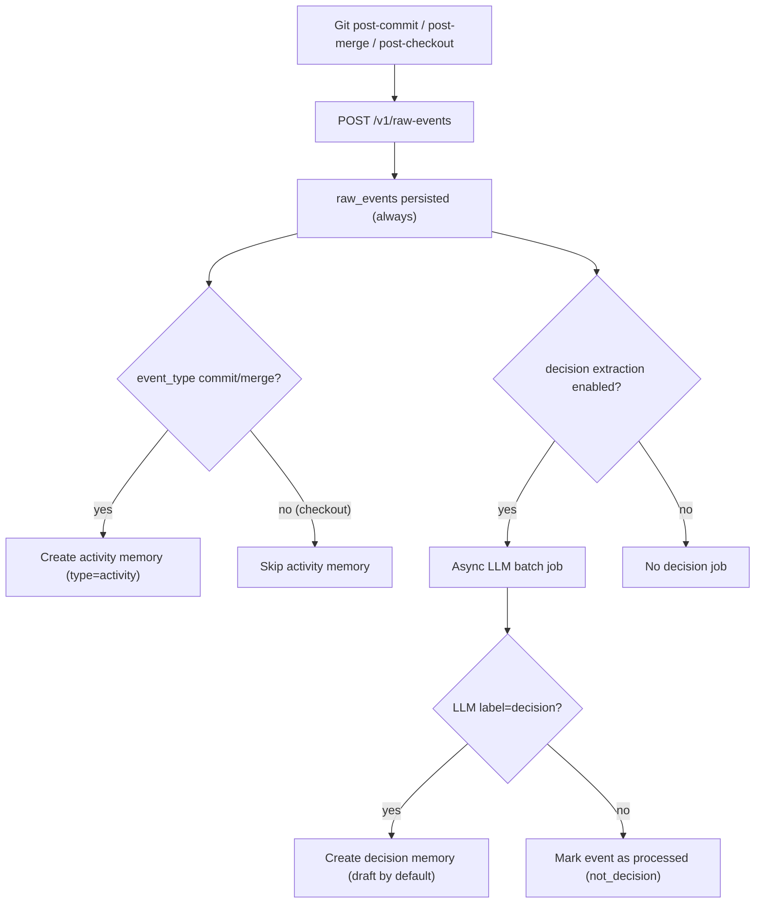

# Decision Extraction Pipeline

Claustrum stores all Git raw events, always.

Then it runs a two-stage memory pipeline:

1. Raw Event -> Activity Memory (deterministic)
2. Raw Event -> Decision Memory (LLM classification)


## Flow




## Important Rule: Keywords Are Scheduling Only

`decision_keyword_policies` affects **LLM processing priority only**.

- It does not create memories by itself.
- It does not confirm decisions by itself.
- It only changes queue order when `decision_extraction_mode=hybrid_priority`.


## Decision Status Policy

Default:

- `decision_default_status = draft`
- `decision_auto_confirm_enabled = false`

Optional auto-confirm:

- Enabled only if `decision_auto_confirm_enabled = true`
- Requires `confidence >= decision_auto_confirm_min_confidence`


## LLM Output Contract

The classifier expects strict JSON:

```json
{
  "label": "decision | not_decision",
  "confidence": 0.0,
  "summary": "1-2 lines",
  "reason": ["bullet 1", "bullet 2"],
  "tags": ["optional-tag"]
}
```


## Operational Notes

- If no LLM provider key/config is available, decision extraction is skipped safely and retried later.
- Activity logging is deterministic and cheap.
- Decision extraction cost is controlled by:
  - `decision_batch_size`
  - `decision_backfill_days`
  - `decision_extraction_mode` (`llm_only` vs `hybrid_priority`)
