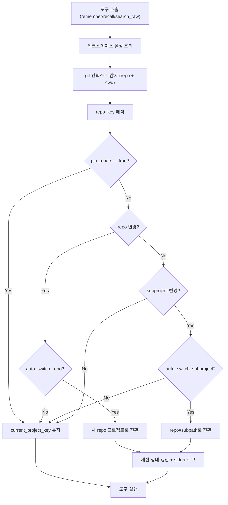

# 운영 가이드


## 데이터/리콜 모델

- 기본 recall은 `memories`만 조회
- raw 임포트 원문은 기본 recall과 분리
- raw 조회는 옵션 도구에서 snippet-only로 제공


## Raw 임포트 파이프라인

1. `POST /v1/imports` (multipart 업로드)
2. `POST /v1/imports/:id/parse`
3. `POST /v1/imports/:id/extract`
4. `POST /v1/imports/:id/commit`

데이터 흐름:
- `imports` -> `raw_sessions/raw_messages` -> `staged_memories` -> `memories`

파서 지원:
- `source=codex`: Codex JSONL 전용 파서
- `source=claude`: Claude JSON export 전용 파서 (역할 정규화: `human -> user`, `assistant -> assistant`)
- 그 외: generic 텍스트 청크 파서 fallback


## 프로젝트 자동 선택

기본 우선순위:
1. `github_remote`
2. `repo_root_slug`
3. `manual`

워크스페이스 설정:
- `resolution_order`
- `auto_create_project`
- key prefix
- `project_mappings`


## 자동 전환 흐름

`ensureContext()`는 `remember`, `recall`, `search_raw` 실행 전에 호출됩니다.



기본값:
- `auto_switch_repo=true`
- `auto_switch_subproject=false`
- `enable_monorepo_resolution=false`
- `monorepo_detection_level=2`

## CI 성공/실패 감사 이벤트

- 엔드포인트: `POST /v1/ci-events`
- 기록 action:
  - success -> `ci.success`
  - failure -> `ci.failure`
- Slack 연동:
  - Slack `action_prefixes`에 `ci.` 포함
  - `status=failure`는 자동으로 high severity로 분류
- GitHub Actions 예제:
  - `.github/workflows/claustrum-ci-events.yml`
  - 저장소 시크릿 설정:
    - `MEMORY_CORE_URL`
    - `MEMORY_CORE_API_KEY`
    - `MEMORY_CORE_WORKSPACE_KEY`
    - 선택: `MEMORY_CORE_PROJECT_KEY`


## Admin UI 운영 체크리스트

- 워크스페이스/프로젝트/멤버 관리
- 자동 선택 설정/매핑 관리
- CI Events 패널에서 success/failure 이벤트 전송
- 임포트 실행 후 staged memory 커밋
- raw snippet 검색
- audit 로그(`ci.failure`, `ci.success`, `raw.search`, `raw.view`) 검토


## 자주 쓰는 명령어

```bash
pnpm install
pnpm db:migrate
pnpm db:seed
pnpm dev
pnpm test:workspace
```


## 백업/복구 기본 권장

- Postgres 정기 백업
- migration SQL 버전관리 유지
- 복구 검증 시 순서:
  - migrate
  - seed (idempotent)
  - smoke test
