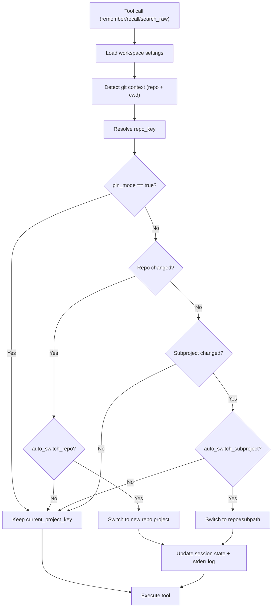

# Operations


## Data and Recall Model

- Default recall reads from `memories` only.
- Raw imported transcripts are separated from default recall flow.
- Optional raw tools return snippets only.


## Raw Import Pipeline

1. `POST /v1/imports` (multipart upload)
2. `POST /v1/imports/:id/parse`
3. `POST /v1/imports/:id/extract`
4. `POST /v1/imports/:id/commit`

Data path:
- `imports` -> `raw_sessions/raw_messages` -> `staged_memories` -> `memories`

Supported parser behavior:
- `source=codex`: Codex JSONL parser
- `source=claude`: Claude JSON export parser (role normalization: `human -> user`, `assistant -> assistant`)
- fallback: generic text chunk parser


## Project Resolution

Default order:
1. `github_remote`
2. `repo_root_slug`
3. `manual`

Configured at workspace level:
- `resolution_order`
- `auto_create_project`
- key prefixes
- `project_mappings`


## Auto Switch Flow

`ensureContext()` runs before `remember`, `recall`, and `search_raw`.



Defaults:
- `auto_switch_repo=true`
- `auto_switch_subproject=false`
- `enable_monorepo_resolution=false`
- `monorepo_detection_level=2`

## CI Failure/Success Audit

- Endpoint: `POST /v1/ci-events`
- Action emitted:
  - success -> `ci.success`
  - failure -> `ci.failure`
- Slack forwarding:
  - include `ci.` in Slack `action_prefixes`
  - `status=failure` is automatically treated as high severity
- GitHub Actions example:
  - `.github/workflows/claustrum-ci-events.yml`
  - set repository secrets:
    - `MEMORY_CORE_URL`
    - `MEMORY_CORE_API_KEY`
    - `MEMORY_CORE_WORKSPACE_KEY`
    - optional `MEMORY_CORE_PROJECT_KEY`


## Admin UI Checklist

- Manage workspace/project/member
- Manage resolution settings and mappings
- Send CI success/failure events from the CI Events panel
- Run imports and commit staged memories
- Execute raw snippet search
- Review audit logs (`ci.failure`, `ci.success`, `raw.search`, `raw.view`)


## Useful Commands

```bash
pnpm install
pnpm db:migrate
pnpm db:seed
pnpm dev
pnpm test:workspace
```


## Backup/Recovery Baseline

- Back up Postgres regularly.
- Keep migration SQL in version control.
- Verify restore by replaying:
  - migrate
  - seed (idempotent)
  - smoke tests
