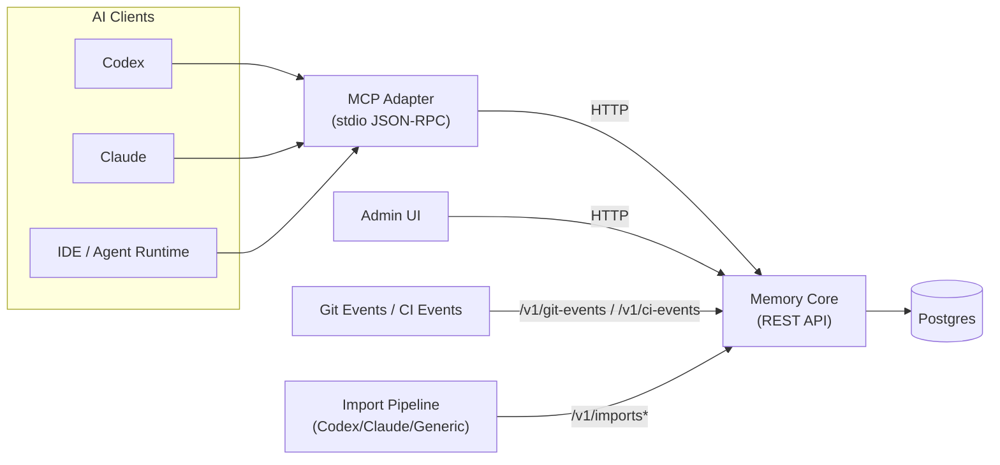
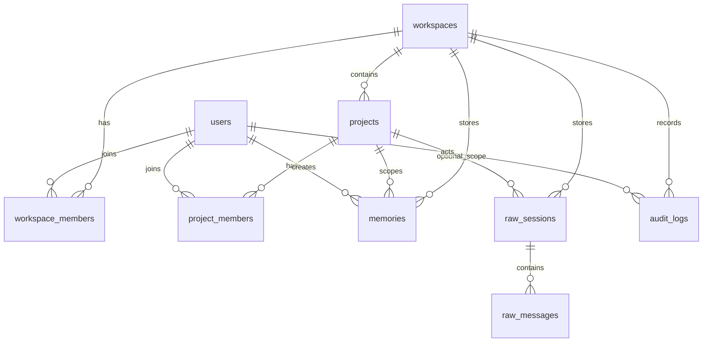

# Arquitectura de Claustrum

## Topología general

## Modelo de datos (ERD simplificado)

## Resolución de proyecto

Orden del resolver:

1. `github_remote`
2. `repo_root_slug`
3. `manual`

Formato de key en monorepo:

- `github:owner/repo`
- `github:owner/repo#apps/memory-core`

La detección de subproyecto es por ruta y se controla en `workspace_settings`.

## Auto-switch y modo pin

- `ensureContext()` corre antes de `remember`, `recall` y `search_raw`.
- El cambio automático de repo depende de `auto_switch_repo`.
- El cambio automático de subproyecto depende de `auto_switch_subproject`.
- `set_project` activa pin mode y se mantiene hasta `unset_project_pin()`.

## Protecciones para import y búsqueda raw

- Flujo raw import: upload -> parse -> extract -> commit.
- El recall por defecto sigue usando `memories`.
- Raw search devuelve solo snippets con límite de longitud.
- Todo acceso raw queda registrado en `audit_logs`.
