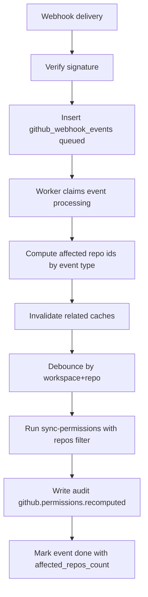

# Recomputación parcial de GitHub

Con webhooks de GitHub, Claustrum recalcula solo los repos afectados, en lugar de recalcular todo el workspace.

## Eventos soportados

- `installation_repositories`
- `team`
- `membership`
- `repository`
- `team_add`
- `team_remove`

## Cómo calcula el alcance afectado

- `installation_repositories`:
  - usa `repositories_added` / `repositories_removed`
  - sincroniza y recalcula solo esos repos
- `team` / `membership`:
  - toma `team.id` y busca repos impactados
- `repository` rename:
  - actualiza `github_repo_links.full_name`
- `team_add` / `team_remove`:
  - invalida caché del repo y vuelve a calcular

## Invalidación de caché

- team-related: `github_team_members_cache`
- repo-team related: `github_repo_teams_cache`
- antes de recalcular: `github_permission_cache`

## Debounce

Si hay recálculos repetidos para el mismo `workspace_id + repo_id`, se agrupan en una ventana corta (8s).

## Flujo del worker

## Operación

- `delivery_id` único garantiza idempotencia
- reintentos: hasta 3
- firma inválida: `401` + `github.webhook.signature_failed`
