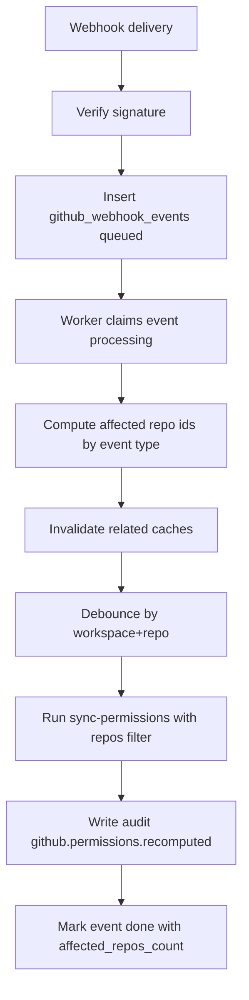

# GitHub Partial Recompute (GH-4.1)

## Goal

When GitHub sends webhook events, Claustrum recomputes permissions only for impacted repositories instead of running a full workspace-wide recompute.

## Supported Events

- `installation_repositories`
- `team`
- `membership`
- `repository`
- `team_add`
- `team_remove`

## Event -> Affected Scope

- `installation_repositories`
  - reads `repositories_added` + `repositories_removed`
  - runs repo sync for only those repo names
  - recomputes permissions for linked affected repos only

- `team` / `membership`
  - extracts `team.id`
  - finds affected repos from `github_repo_teams_cache`
  - recomputes only those repos

- `repository` (`action=renamed`)
  - updates `github_repo_links.full_name`
  - no permission recompute by default

- `team_add` / `team_remove`
  - extracts repository + team
  - invalidates repo/team caches
  - recomputes affected repo only

## Cache Invalidation

- team-related events:
  - delete `github_team_members_cache` for the team

- repo-team related events:
  - delete `github_repo_teams_cache` for affected repo ids

- before partial recompute:
  - delete `github_permission_cache` for affected repo ids

## Debounce

To avoid burst recomputation, repeated recompute for the same `workspace_id + repo_id` is debounced with a short window (8 seconds).

## Worker Flow

## Operations Notes

- delivery dedupe is guaranteed by `delivery_id` unique constraint
- failed events retry up to 3 attempts
- signature failures return `401` and are audited as `github.webhook.signature_failed`
- webhook mode (`add_only` / `add_and_remove`) controls webhook-driven role updates
