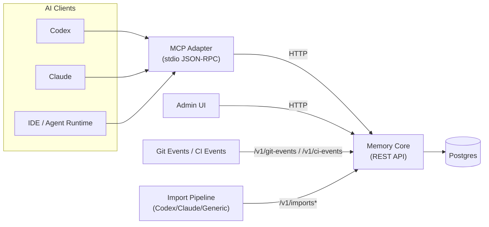
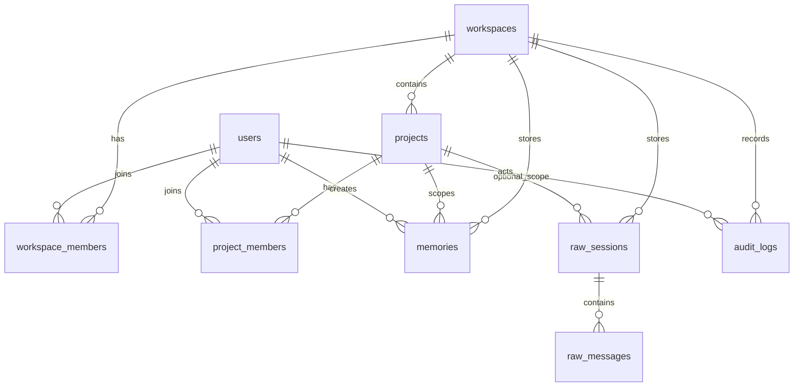

# Claustrum アーキテクチャ

## 全体トポロジー

## データモデル（簡略 ERD）

## プロジェクト解決（Resolver）

優先順:

1. `github_remote`
2. `repo_root_slug`
3. `manual`

モノレポのキー形式:

- `github:owner/repo`
- `github:owner/repo#apps/memory-core`

サブプロジェクト検出はパスベースで、`workspace_settings` のポリシーで制御されます。

## Auto Switch と Pin モード

- `ensureContext()` は `remember` / `recall` / `search_raw` の前に実行
- リポジトリ切り替えは `auto_switch_repo` で制御
- サブプロジェクト切り替えは `auto_switch_subproject` で個別制御
- `set_project` で pin mode に入り、`unset_project_pin()` まで固定

## Raw インポートと検索のガードレール

- raw import フロー: upload -> parse -> extract -> commit
- 既定の recall は `memories` 中心
- raw search は snippet のみ返却（長さ上限あり）
- raw アクセスは必ず `audit_logs` に記録
