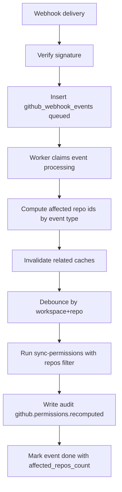

# GitHub 部分再計算

GitHub webhook 受信時に、workspace 全体ではなく影響 repo だけ再計算する仕組みです。

## 対応イベント

- `installation_repositories`
- `team`
- `membership`
- `repository`
- `team_add`
- `team_remove`

## 影響範囲の決め方

- `installation_repositories`:
  - `repositories_added` / `repositories_removed` を読み取り
  - 変更 repo のみ sync + permission 再計算
- `team` / `membership`:
  - `team.id` から影響 repo を抽出
- `repository` rename:
  - `github_repo_links.full_name` 更新（通常は権限再計算なし）
- `team_add` / `team_remove`:
  - 該当 repo の cache 無効化 + 再計算

## Cache 無効化

- team 関連: `github_team_members_cache`
- repo-team 関連: `github_repo_teams_cache`
- 再計算前: `github_permission_cache`

## Debounce

同じ `workspace_id + repo_id` の連続再計算は短時間（8 秒）デバウンスします。

## Worker フロー

## 運用メモ

- `delivery_id` 一意制約で冪等性を担保
- 失敗イベントは最大 3 回再試行
- 署名不正は `401` + `github.webhook.signature_failed`
