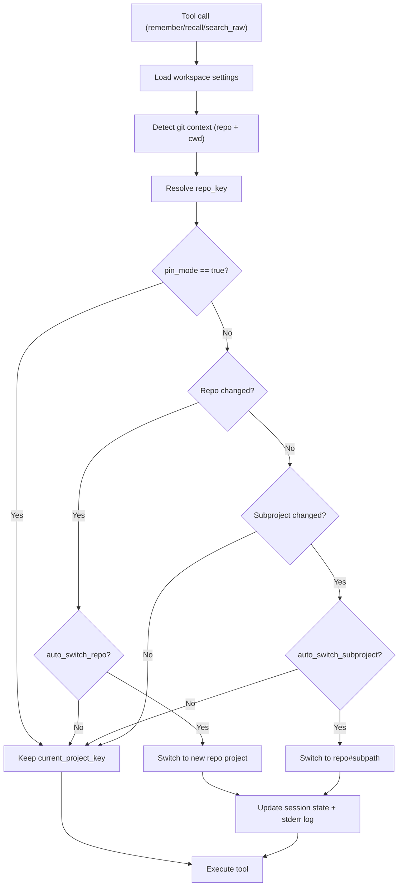

# 운영 가이드

## 데이터/조회 기본 원칙

- 기본 `recall`은 `memories`만 조회합니다.
- raw 원문 데이터는 기본 조회 경로와 분리되어 있습니다.
- raw 조회 도구는 스니펫만 반환하며 전체 원문을 노출하지 않습니다.

## Raw Import 파이프라인

1. `POST /v1/imports` (파일 업로드)
2. `POST /v1/imports/:id/parse`
3. `POST /v1/imports/:id/extract`
4. `POST /v1/imports/:id/commit`

데이터 흐름:

- `imports` → `raw_sessions/raw_messages` → `staged_memories` → `memories`

지원 파서:

- `source=codex`: Codex JSONL
- `source=claude`: Claude export (역할 정규화 포함)
- fallback: generic text chunk parser

## 프로젝트 해석(Resolver)

기본 우선순위:

1. `github_remote`
2. `repo_root_slug`
3. `manual`

워크스페이스에서 조정 가능:

- `resolution_order`
- `auto_create_project`
- key prefix
- `project_mappings`

## 자동 전환 정책

`ensureContext()`는 `remember`, `recall`, `search_raw` 실행 전에 항상 호출됩니다.



기본값:

- `auto_switch_repo=true`
- `auto_switch_subproject=false`
- `enable_monorepo_resolution=false`
- `monorepo_detection_level=2`

## CI 이벤트 수집

- 엔드포인트: `POST /v1/ci-events`
- 이벤트: `ci.success`, `ci.failure`
- Slack 연동 시 `ci.` prefix를 필터에 포함하면 자동 전송 가능

필요한 GitHub Actions secret:

- `MEMORY_CORE_URL`
- `MEMORY_CORE_API_KEY`
- `MEMORY_CORE_WORKSPACE_KEY`
- (선택) `MEMORY_CORE_PROJECT_KEY`

## Admin UI 운영 체크리스트

- 워크스페이스/프로젝트/멤버 관리
- Resolver 설정/매핑 관리
- Import 실행 및 staged memory 커밋
- Raw search 실행
- Audit 로그 점검 (`ci.failure`, `ci.success`, `raw.search`, `raw.view`)

## 자주 쓰는 명령어

```bash
pnpm install
pnpm db:migrate
pnpm db:seed
pnpm dev
pnpm test:workspace
```

## 버전 정책

- 명시적인 릴리스 결정이 없으면 `major.minor`는 유지합니다.
- 일반 유지보수 릴리스는 patch만 올립니다 (`x.y.Z`).
- 루트 버전 올릴 때는 `pnpm version:patch`를 사용합니다.

## 입력 검증 가드레일

- HTTP 라우트는 서비스 진입 전에 Zod로 요청을 검증합니다.
- CI/로컬 lint에서 `scripts/check-route-zod-boundary.mjs`를 실행해 라우트 경계 검증 누락을 막습니다.
- 서비스 계층 검증은 도메인 불변성용 2차 안전장치로 유지됩니다.

## 백업/복구 기준

- Postgres 정기 백업
- migration SQL 버전 관리
- 복구 리허설: 마이그레이션 + 시드 + 스모크 테스트
