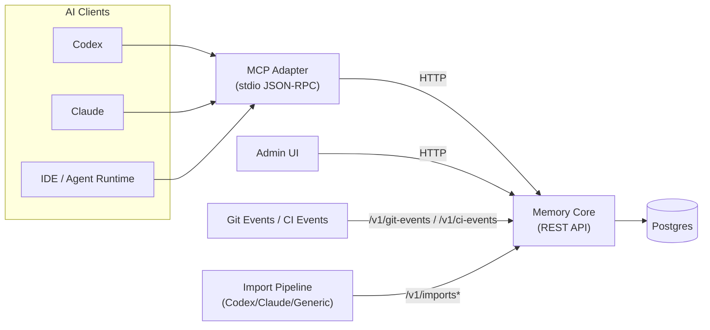
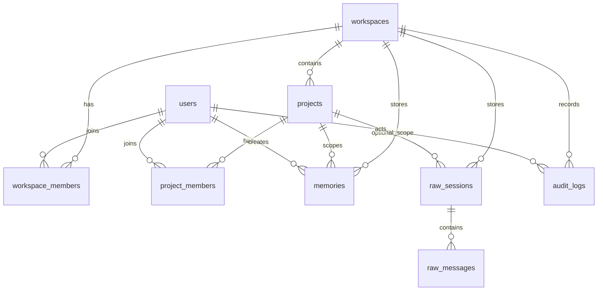

# Claustrum 架构

## 整体拓扑

## 数据模型（简化 ERD）

## 项目解析（Resolver）

解析优先顺序：

1. `github_remote`
2. `repo_root_slug`
3. `manual`

Monorepo key 形式：

- `github:owner/repo`
- `github:owner/repo#apps/memory-core`

子项目检测基于路径，并由 `workspace_settings` 策略控制。

## Auto-switch 与 Pin 模式

- `ensureContext()` 会在 `remember`、`recall`、`search_raw` 前执行。
- Repo 自动切换由 `auto_switch_repo` 控制。
- 子项目自动切换由 `auto_switch_subproject` 控制。
- 调用 `set_project` 后进入 pin 模式，直到 `unset_project_pin()`。

## Raw 导入与检索护栏

- raw import 流程：upload -> parse -> extract -> commit。
- 默认 recall 仍以 `memories` 为主。
- raw search 只返回 snippet，并有长度上限。
- raw 访问会写入 `audit_logs`。
