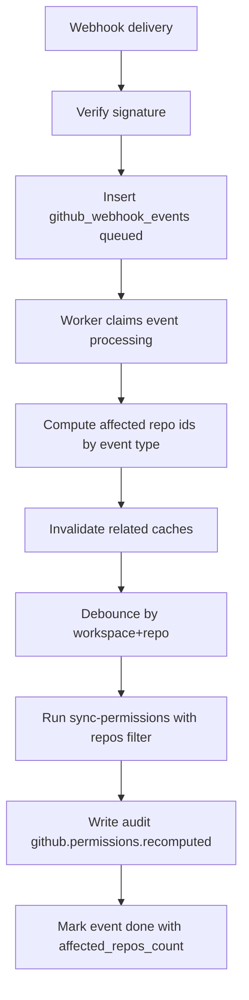

# GitHub 局部重算

收到 GitHub webhook 后，只重算受影响 repo 的权限，避免全量重算。

## 支持事件

- `installation_repositories`
- `team`
- `membership`
- `repository`
- `team_add`
- `team_remove`

## 影响范围计算

- `installation_repositories`:
  - 读取 `repositories_added` / `repositories_removed`
  - 仅同步并重算这些 repo
- `team` / `membership`:
  - 读取 `team.id`，定位受影响 repo
- `repository` rename:
  - 更新 `github_repo_links.full_name`
- `team_add` / `team_remove`:
  - 失效相关 cache 后重算该 repo

## Cache 失效策略

- team 相关：`github_team_members_cache`
- repo-team 相关：`github_repo_teams_cache`
- 重算前：`github_permission_cache`

## Debounce

同一 `workspace_id + repo_id` 的重复重算会做短窗口去抖（8 秒）。

## Worker 流程

## 运行说明

- `delivery_id` 唯一约束保证幂等
- 失败最多重试 3 次
- 签名失败返回 `401`，并记录 `github.webhook.signature_failed`
