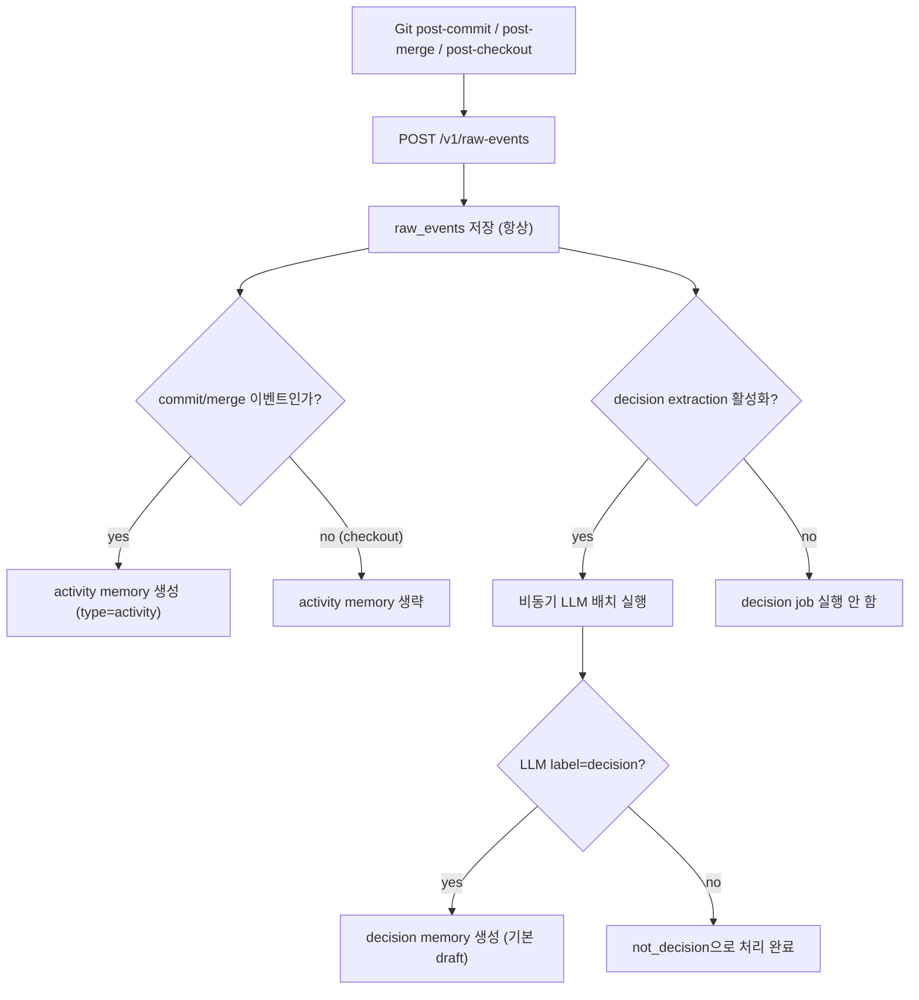

# Decision Extraction 파이프라인

Claustrum은 Git raw 이벤트를 항상 저장합니다.

그 다음 메모리 파이프라인을 2단계로 실행합니다.

1. Raw Event -> Activity Memory (규칙 기반)
2. Raw Event -> Decision Memory (LLM 분류 기반)


## 흐름




## 중요 규칙: 키워드는 스케줄링 전용

`decision_keyword_policies`는 **LLM 처리 우선순위 조정**에만 사용됩니다.

- 키워드만으로 memory를 만들지 않습니다.
- 키워드만으로 decision을 확정하지 않습니다.
- `decision_extraction_mode=hybrid_priority`일 때만 우선순위 점수에 반영됩니다.


## Decision 상태 정책

기본:

- `decision_default_status = draft`
- `decision_auto_confirm_enabled = false`

옵션 auto-confirm:

- `decision_auto_confirm_enabled = true`일 때만 동작
- `confidence >= decision_auto_confirm_min_confidence` 조건 필요


## LLM 출력 계약

분류기는 아래 JSON 형식을 기대합니다.

```json
{
  "label": "decision | not_decision",
  "confidence": 0.0,
  "summary": "1-2 lines",
  "reason": ["bullet 1", "bullet 2"],
  "tags": ["optional-tag"]
}
```


## 운영 참고

- LLM provider 설정/키가 없으면 decision extraction은 안전하게 skip되고, 이후 재시도됩니다.
- activity logging은 결정론적이며 비용이 낮습니다.
- decision extraction 비용/처리량은 아래 값으로 제어합니다.
  - `decision_batch_size`
  - `decision_backfill_days`
  - `decision_extraction_mode` (`llm_only`, `hybrid_priority`)
