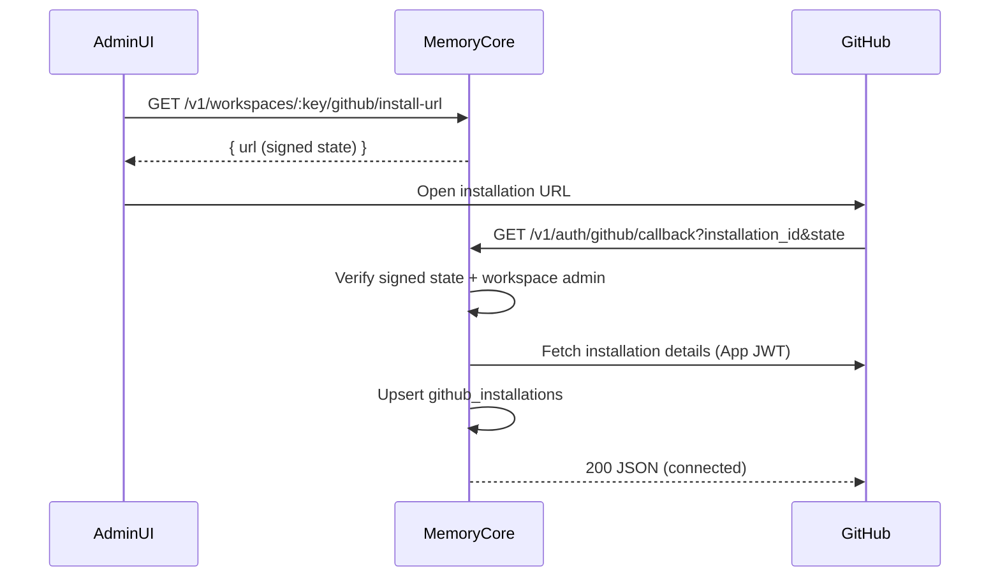

# GitHub Integration (Workspace Scope)

## Scope

This page covers the base workspace-level GitHub App connection and repository sync.

Related phases:

- GH-2: repo sync + auto project linking (`github-auto-projects`)
- GH-3: user link + permission sync (`github-permission-sync`)
- GH-4: webhook automation + team mapping (`github-webhooks`, `github-team-mapping`)

## Workspace-Level Model

Each workspace can have **0 or 1** GitHub App installation.

- `github_installations`: installation metadata per workspace
- `github_repo_links`: synced repository cache for browsing and future mapping

## Environment Variables

Required for server-side GitHub App calls:
- `GITHUB_APP_ID`
- `GITHUB_APP_PRIVATE_KEY`

Optional:
- `GITHUB_APP_WEBHOOK_SECRET` (required to verify GitHub webhook signatures in GH-4)
- `GITHUB_APP_NAME` or `GITHUB_APP_URL` (install link generation)
- `MEMORY_CORE_GITHUB_STATE_SECRET` (signed state override)

`GITHUB_APP_PRIVATE_KEY` supports:
- raw PEM
- PEM with escaped newlines (`\n`)
- base64-encoded PEM

## Installation Flow

## API Endpoints

- `GET /v1/workspaces/:key/github/install-url`
  - Auth: workspace admin+
  - Returns GitHub App install URL with signed `state`.

- `GET /v1/auth/github/callback?installation_id=...&state=...`
  - Validates signed state and admin identity encoded in state
  - Upserts `github_installations`
  - Audit: `github.installation.connected`

- `POST /v1/workspaces/:key/github/sync-repos`
  - Auth: workspace admin+
  - Mints short-lived installation token (not stored)
  - Fetches accessible repos and upserts `github_repo_links`
  - Marks missing repos inactive
  - Audit: `github.repos.synced`

- `GET /v1/workspaces/:key/github/repos`
  - Auth: workspace member+
  - Returns cached active repos (`full_name`, `private`, `default_branch`)

- `GET /v1/workspaces/:key/github/installation`
  - Auth: workspace member+
  - Returns connection status for Admin UI

## Security Notes

- Installation access tokens are short-lived and never persisted.
- Callback state is signed and time-limited.
- Callback validates that the actor in state is still workspace admin/owner.
- Private key is server-side only.
