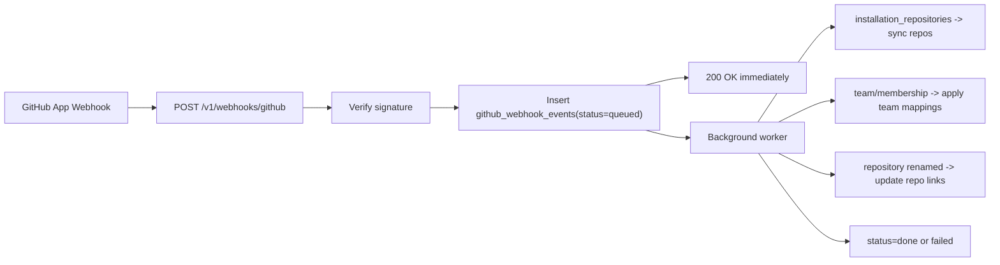

# GitHub Webhooks (GH-4)

## Scope

GH-4 adds GitHub App webhook automation on top of GH-2 (repo sync) and GH-3 (permission sync).

Implemented:

- `POST /v1/webhooks/github` with signature verification (`X-Hub-Signature-256`)
- queue-first ingestion in `github_webhook_events`
- in-process async worker (`queued -> processing -> done|failed`)
- automatic repo sync on `installation_repositories`
- optional team mapping application on `team` / `membership`
- repository rename cache update on `repository`
- partial permission recompute only for affected repos ([details](github-partial-recompute))

## Security

- Secret source: `GITHUB_APP_WEBHOOK_SECRET` (env only)
- Invalid/missing signature: rejected before enqueue
- Delivery id dedupe: unique `delivery_id` in DB
- Worker uses idempotent status transitions and retry(3)

## Event Flow

## Workspace Controls

Workspace settings:

- `github_webhook_enabled` (default `false`)
- `github_webhook_sync_mode` (`add_only` | `add_and_remove`, default `add_only`)
- `github_team_mapping_enabled` (default `true`)

If webhook is disabled for a workspace, queued deliveries are acknowledged but ignored by sync logic.

## Admin UI

Location: **Workspace -> Integrations -> GitHub**

- webhook sync toggle/mode
- team mapping enable toggle
- webhook endpoint hint (`/v1/webhooks/github`)
- recent deliveries table (`queued/processing/done/failed`)

## Troubleshooting

- `Invalid GitHub webhook signature`:
  - check App webhook secret matches `GITHUB_APP_WEBHOOK_SECRET`
- deliveries stay `failed`:
  - check `GITHUB_APP_ID` / `GITHUB_APP_PRIVATE_KEY`
  - ensure installation is connected to the workspace
- no team-based role changes:
  - ensure `github_team_mapping_enabled=true`
  - ensure mappings exist and linked users are configured (`github_user_links`)
